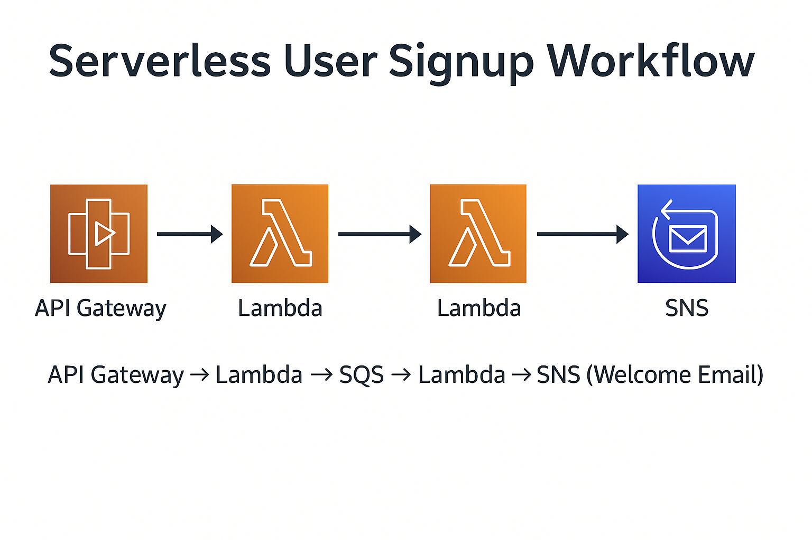
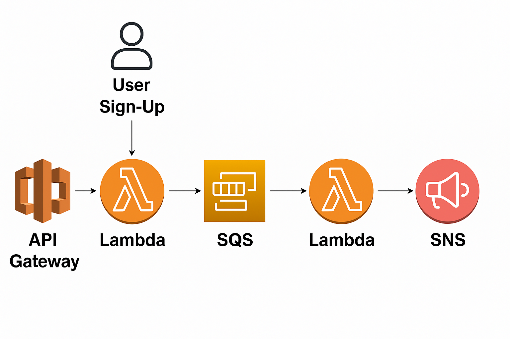

<p align="center">
  
</p>

<p align="center">
  <a href="https://github.com/MrSiddu73">
    
  </a>
</p>

# 🚀 Serverless User Signup Workflow  
**API Gateway → Lambda → SQS → Lambda → SNS (Welcome Email)**


---

## 📌 Project Summary

This project implements a **fully serverless, asynchronous signup pipeline** using AWS:

- Client sends **POST /signup**  
- Lambda 1 validates input → sends message to **SQS**  
- Lambda 2 consumes SQS → sends **SNS welcome email**  
- Fully decoupled, reliable, scalable  

Your design mimics **real microservice architectures** used at Amazon, Netflix, Uber, etc.

---

## 🧱 High-Level Architecture

<p align="center">
  
</p>

**Flow:**  
1️⃣ Client → API Gateway  
2️⃣ Lambda 1 (`SignupHandler`) validates, enqueues  
3️⃣ SQS absorbs load & retries  
4️⃣ Lambda 2 (`ProcessUser`) consumes queue  
5️⃣ SNS sends welcome email  
6️⃣ CloudWatch logs everything  

---

## 📂 Repository Structure

serverless-user-signup/
│── lambda/
│ ├── signup_handler.py
│ └── process_user.py
│── iam/
│ └── lambda_sqs_sns_policy.json
│── docs/
│ ├── banner.png
│ ├── architecture.png
│ └── screenshots/
│ ├── api_test.png
│ ├── sqs_message.pdf
│── README.md
│── .gitignore
│── LICENSE


---

## 🔧 AWS Services Used

| Service | Purpose |
|---------|---------|
| **API Gateway** | Exposes POST /signup |
| **Lambda 1** | Validates + sends message to SQS |
| **SQS Queue** | Decouples processing, retries |
| **Lambda 2** | Consumes queue + sends SNS |
| **SNS Topic** | Sends welcome email |
| **CloudWatch Logs** | Logs for both Lambdas |
| **IAM** | Least-privilege permissions |

---

## 🧩 How It Works (Detailed)

### 1️⃣ POST /signup → Lambda 1  
Input (Thunder Client/Postman):

```json
{
  "name": "Siddu",
  "email": "godnetwork00@gmail.com"
}

Lambda 1 does:

✔ Validate input
✔ Log raw request
✔ Push message to SQS
✔ Return HTTP 200

### 2️⃣ SQS → Lambda 2 (automatic trigger)
SQS sends event like:

{
  "Records": [
    {
      "body": "{\"name\": \"Siddu\", \"email\": \"godnetwork00@gmail.com\"}"
    }
  ]
}
Lambda 2:

✔ Parses message
✔ Constructs email text
✔ Publishes to SNS

3️⃣ SNS → Email Delivery

You receive:
Subject: Welcome to Our Platform
Message: Hello Siddu, welcome to our platform!


🧪 Testing the API

Thunder Client or Postman:

POST https://mlau2gc6y0.execute-api.ap-south-1.amazonaws.com/prod/signup

Body:

{
  "name": "Siddu",
  "email": "godnetwork00@gmail.com"
}


# 🎯 **Why This Architecture?**

This project follows **event-driven microservice design**, a standard used by Amazon, Netflix, and Uber because it provides:

* **Loose coupling**
* **Automatic retry + DLQ safety**
* **Independent scaling of producers and consumers**
* **Fault tolerance**
* **High availability without servers**

This aligns you with **real cloud architecture patterns** interviewers love.

---

# 🧰 **Tech Stack**

| Layer           | Technology                        |
| --------------- | --------------------------------- |
| API Layer       | Amazon API Gateway (REST)         |
| Compute         | AWS Lambda (Python 3.9)           |
| Messaging Queue | Amazon SQS (Standard Queue + DLQ) |
| Notifications   | Amazon SNS                        |
| Logging         | CloudWatch Logs                   |
| IAM             | Least-Privilege Execution Role    |

---

# 🧪 **API Documentation**

| Endpoint  | Method | Purpose               | Body                                | Response                                   |
| --------- | ------ | --------------------- | ----------------------------------- | ------------------------------------------ |
| `/signup` | `POST` | Send user signup data | `{ "name": "...", "email": "..." }` | `{"message":"Signup received and queued"}` |

### **Request Example**

```json
{
  "name": "Siddu",
  "email": "godnetwork00@example.com"
}
```

### **Success Response**

```json
{
  "message": "Signup received and queued"
}
```

---

# 🔄 **Sequence Diagram**


Client -> API Gateway: POST /signup
API Gateway -> SignupHandler(Lambda): Invoke with JSON body
SignupHandler -> SQS: SendMessage (user payload)
SQS -> ProcessUser(Lambda): Trigger event
ProcessUser -> SNS: Publish welcome email
SNS -> User Email: Send Notification


---

# 🛑 **Error Handling Summary**

| Error                           | Cause                        | Fix                                              |
| ------------------------------- | ---------------------------- | ------------------------------------------------ |
| `KeyError: 'body'`              | Lambda Proxy disabled        | Re-create POST with **Lambda Proxy Integration** |
| `Missing Authentication Token`  | Using GET instead of POST    | Use POST /signup                                 |
| `AccessDenied: sqs:SendMessage` | Incorrect IAM role           | Attach Lambda-SQS-SNS-Role                       |
| `KeyError: 'Records'`           | Testing Lambda 2 incorrectly | Use SQS event or DLQ test                        |

---

# 💰 **Cost Optimization Tips**

🟢 All services used fall inside **AWS Free Tier**.
But for production:

### Save costs by:

* Enabling **SQS long polling**
* Reducing Lambda timeout to 5 sec
* Deleting test queues/topics
* Setting SNS to daily digest (if multiple emails)

Estimated monthly cost for your pipeline:

| Service                   | Estimated Cost |
| ------------------------- | -------------- |
| Lambda (1M free)          | ₹0             |
| API Gateway (low traffic) | ₹2–₹5          |
| SQS                       | ₹0             |
| SNS (first 1000 emails)   | ₹0             |
| CloudWatch logs           | <₹5            |

Total: **₹5–₹10 / month** (if used lightly)

---

# 📊 **Monitoring & Observability**

Enable:

### ✔ CloudWatch Metrics

* Lambda duration
* Lambda errors
* SQS queue depth
* DLQ incoming messages

### ✔ CloudWatch Alarms

* Alarm if DLQ > 0
* Alarm if Lambda 2 errors > 1/min
* Alarm if API Gateway 5XX spikes


---

# 🌐 **Deployment Flow (CI/CD Ready)**

This project can easily integrate with:

* **GitHub Actions**
* **AWS CodePipeline**
* **Serverless Framework**
* **SAM (Serverless Application Model)**

Example auto-deploy pipeline:

```
git push → GitHub Action → SAM Build → SAM Deploy → Lambda/API/SQS/SNS Updated
```

---

# 🤝 **Contributing**

Want to improve this repo?

1. Fork it
2. Create a feature branch
3. Commit changes
4. PR with explanation
5. Wait for review

---

# 💬 **Contact & Links**

* **GitHub** → [https://github.com/MrSiddu73](https://github.com/MrSiddu73)
* **Email** → [siddusnyamagoud27@gmail.com]
* **LinkedIn** → (https://www.linkedin.com/in/sid73/)

---
